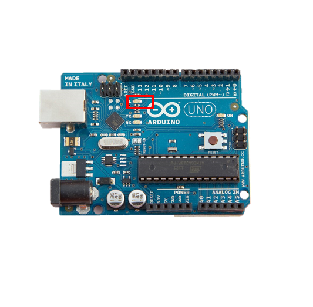
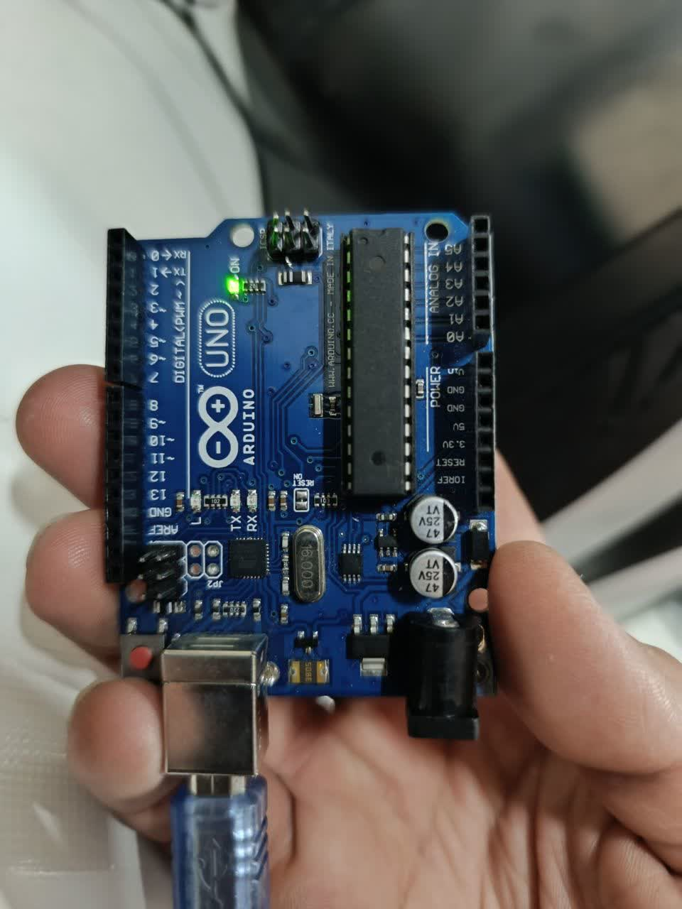

        

# روشن کردنled arduino

## توضیحات کلی پروژه:

 led موجود بر روی مدار اردینو را روشن کردیم 

## ابزارهای مورد نیاز:
برد آردوینو (Arduino )


## تصاویر :





## کد پروژه:

```cpp

int led = 13;
 
void setup () {
pinMode (led, OUTPUT); 
}
Void loop () {
digitalWrite (led, HIGH);
delay (1000);
digitalWrite (led, LOW);
delay (1000);
}

```


