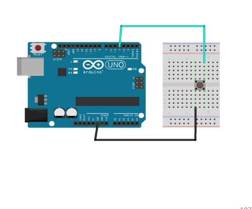
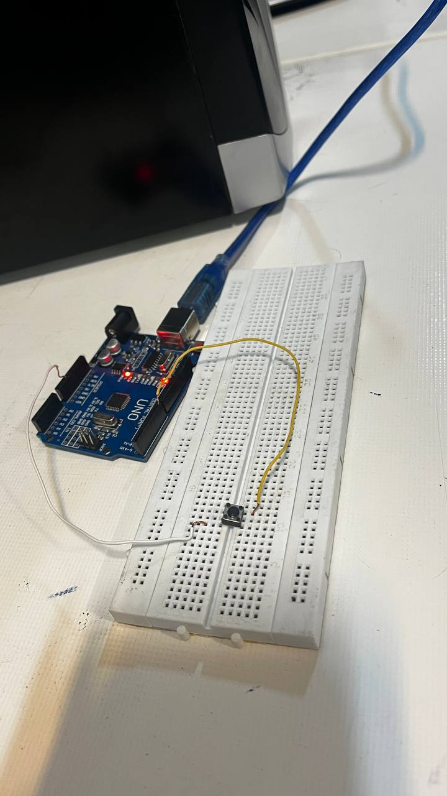

        

# روشن خاموش کردن Led Arduino 

## توضیحات کلی پروژه:

 پروژه ۲ در این پروژه با بستن یک مدار ساده که در آن یک دکمه وجود دارد led موجود بر روی اردینو را روشن و خاموش کردیم به این صورت که با فشار دادن دکمه led روشن و با رها کردنش led خاموش شود 

## ابزارهای مورد نیاز:
برد آردوینو (Arduino )
(push button) دکمه فشاری
سیم های رابط
بردبورد 

## تصاویر :





## کد پروژه:

```cpp

int led = 13;
 
void setup () {
pinMode (led, OUTPUT); 
}
Void loop () {
digitalWrite (led, HIGH);
delay (1000);
digitalWrite (led, LOW);
delay (1000);
}

```


