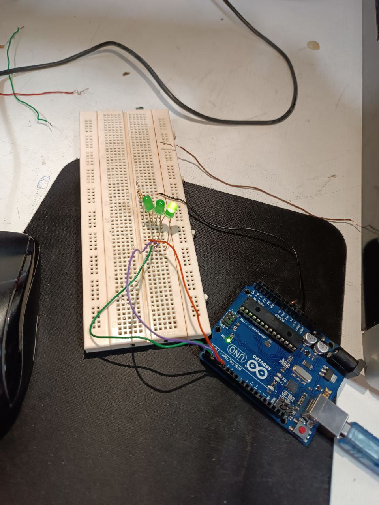

        

# چراغ راهنمایی

## توضیحات کلی پروژه:

 در این پروژه با استفاده از سه led چراغ راهنمایی درست کردیم که در تایم های مشخص خاموش و روشن می شوند

## ابزارهای مورد نیاز:
برد آردوینو (Arduino )__
(push button) دکمه فشاری__
سیم های رابط__
بردبورد __
3عدد led__
مقاومت 220


## تصاویر :





## کد پروژه:

```cpp

int led1 = 2;
int led2 = 3;
int led3 = 4;

void setup() {
  // put your setup code here, to run once:
pinMode(led1, OUTPUT);
pinMode(led2, OUTPUT);
pinMode(led3, OUTPUT);
}
void loop() {
  // put your main code here, to run repeatedly:

  digitalWrite(led1, HIGH);
    delay(5000);
  digitalWrite(led1, LOW);

  digitalWrite(led2, HIGH);
  delay(500);
  digitalWrite(led2, LOW);

    digitalWrite(led3, HIGH);
    delay(5000);
  digitalWrite(led3, LOW);

}


```


